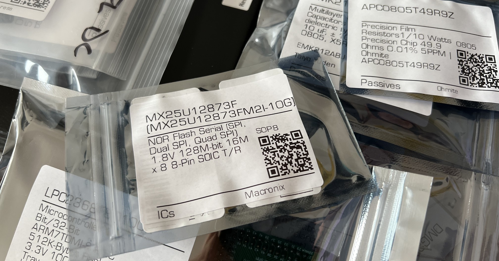
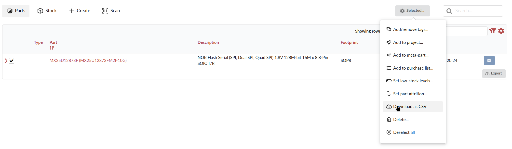
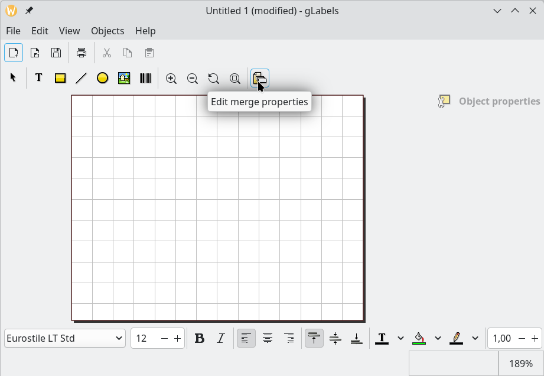
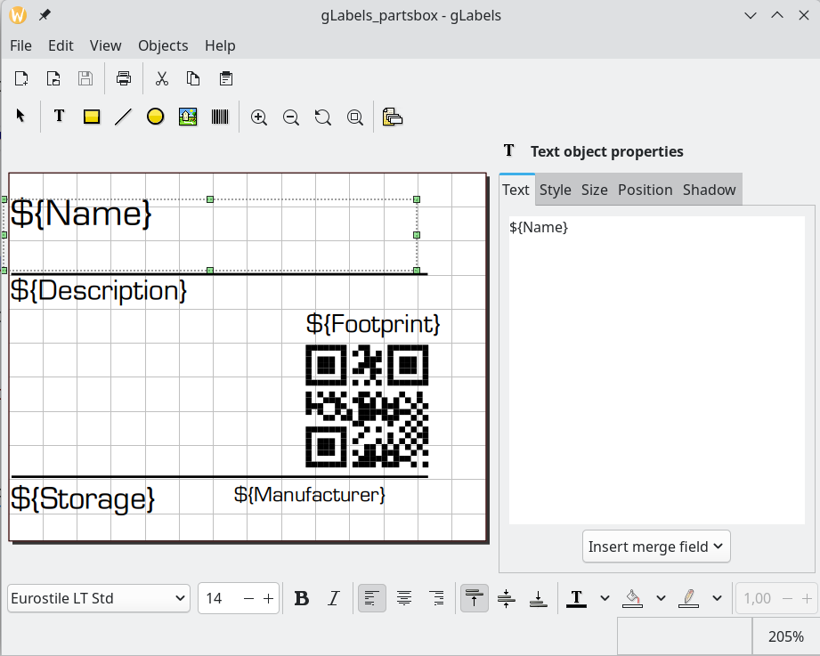

# Electronic parts labelling workflow
I'm dumping here my workflow for generating labels for electronic parts, and
printing them on a label printer.


## Requirements
### Software
- [lprint](https://www.msweet.org/lprint/lprint.html)
- CUPS
- [gLabels](https://help.gnome.org/users/glabels/stable//)

### Hardware
You can probably use any label printer or label that is supported by lprint,
but some [customization](https://github.com/michaelrsweet/lprint/pull/152)
might be needed.

- DYMO LabelWriter 400
- DYMO 99015 diskette labels: they are the right size to fit my ziplock bags,
and have enough space for a QR code and some text.
- (ESD safe) ziplocks. Common sizes I use are:
	- 6x9 cm
	- 9x13 cm
	- 13x18 cm

## Workflow
### PartsBox
Get a csv file from PartsBox with the parts you want to label


### Generate labels
**NOTE:** You can skip to the next section if you're using my label template
(uses Eurostile LT Standard font).

1. Create a new empty label in gLabels (might have to create a template as well
for your label size).
2. Select your csv file as the data source in gLabels

Format: `Text: Comma Separated Values (CSV) with keys on line 1`<br>
Location: \<your csv>
3. Create a label with `Insert merge field` for each field you want to include


### Configure lprint
```bash
$ lprint devices # List available devices
$ lprint drivers # List all supported printers
$ lprint add -d <LPRINT_PRINTER_NAME> -v <URI_FROM_devices> -m <DRIVER_NAME>
$ sudo systemctl enable --now lprint.service
```
Now you can navigate to `http://localhost:8000` (or the port you see in
`systemctl status lprint`), and configure your printer there: set print media,
printer defaults, print a test page, etc.

### Configure CUPS
```bash
$ lpadmin -p <CUPS_PRINTER_NAME> -v ipp://localhost:8000/ipp/print/<LPRINT_PRINTER_NAME> -m everywhere
```
Now the printer is available to all applications that use CUPS.

### Print
To print the labels, you can either use gLabels GUI (one at a time), or
generate all the labels in bulk and print them with lpr:
```bash
$ glabels-3-batch gLabels_partsbox.glabels
$ lrp output.pdf
```

Other, "smarter" pdf print tools (e.g. Okular print dialog) might break the
margin settings, so I recommend using lpr.

## TODO
- [ ] A more convenient way to print one label from your parts without having
to generate a csv file from the website. PartsBox APIs?
- [ ] Some python GUI/browser extension to create parts on PartsBox and print
them straight away with APIs?
